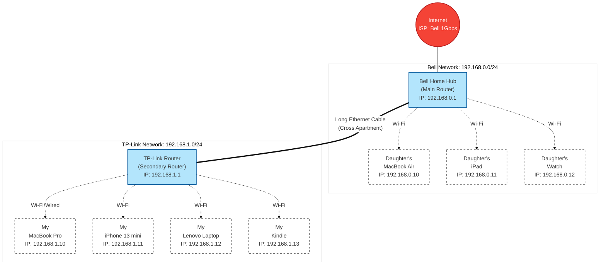

# Home Network Documentation 🏠

This repository documents the network architecture, devices, and configurations of my home network.

## 🌐 Network Topology

Below is the visual representation of our current network setup, spanning across the apartment and divided into two main subnets.

## 📝 Device Directory

| Owner | Device | IP Address | Connection |
| :--- | :--- | :--- | :--- |
| **Network** | Bell Home Hub (Main) | `192.168.0.1` | WAN |
| **Network** | TP-Link Router (Secondary) | `192.168.1.1` | Ethernet to Main |
| **Daughter** | MacBook Air | `192.168.0.10` | Wi-Fi (Bell) |
| **Daughter** | iPad | `192.168.0.11` | Wi-Fi (Bell) |
| **Daughter** | Apple Watch | `192.168.0.12` | Wi-Fi (Bell) |
| **Mine** | MacBook Pro | `192.168.1.10` | Wi-Fi/Wired (TP-Link) |
| **Mine** | iPhone 13 mini | `192.168.1.11` | Wi-Fi (TP-Link) |
| **Mine** | Lenovo Laptop | `192.168.1.12` | Wi-Fi (TP-Link) |
| **Mine** | Kindle | `192.168.1.13` | Wi-Fi (TP-Link) |
