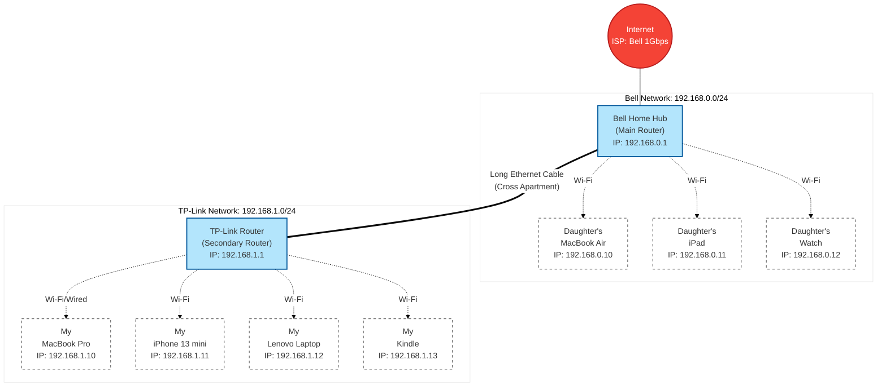

# Home Network Documentation 🏠

This repository documents the network architecture, devices, and configurations of my home network.

## 🌐 Network Topology

Below is the visual representation of our current network setup, spanning across the apartment and divided into two main subnets.

## 📝 Device Directory

| Owner | Device | IP Address | Connection |
| :--- | :--- | :--- | :--- |
| **Network** | Bell Home Hub (Main) | `192.168.0.1` | WAN |
| **Network** | TP-Link Router (Secondary) | `192.168.1.1` | Ethernet to Main |
| **Daughter** | MacBook Air | `192.168.0.10` | Wi-Fi (Bell) |
| **Daughter** | iPad | `192.168.0.11` | Wi-Fi (Bell) |
| **Daughter** | Apple Watch | `192.168.0.12` | Wi-Fi (Bell) |
| **Mine** | MacBook Pro | `192.168.1.10` | Wi-Fi/Wired (TP-Link) |
| **Mine** | iPhone 13 mini | `192.168.1.11` | Wi-Fi (TP-Link) |
| **Mine** | Lenovo Laptop | `192.168.1.12` | Wi-Fi (TP-Link) |
| **Mine** | Kindle | `192.168.1.13` | Wi-Fi (TP-Link) |

## 📍 Physical Topology Details
* **Bell Home Hub (Main Router):** Located in my daughter's bedroom. Connected to the ISP via fiber optic cable.
* **TP-Link Router (Secondary):** Located in my bedroom. Connected to the Bell Router via a Cat6 Ethernet cable (Bell LAN Port 1 to TP-Link WAN Port).
* All wireless devices are connected using the 5GHz or 2.4GHz bands depending on distance and capability.

## ⚙️ Device Configurations & Services
**1. Bell Home Hub 3000/4000 (Gateway)**
* **Role:** Modem, Main Router, DHCP Server, DNS Forwarder
* **Subnet:** 192.168.0.0/24
* **DHCP Range:** 192.168.0.50 - 192.168.0.200
* **Wi-Fi Security:** WPA2/WPA3 Personal

**2. TP-Link Router**
* **Role:** Secondary Router (NAT enabled), Wi-Fi Access Point, DHCP Server
* **Subnet:** 192.168.1.0/24
* **DHCP Range:** 192.168.1.50 - 192.168.1.200
* **Wi-Fi Security:** WPA2/WPA3 Personal

## 🔒 Security & Credential Storage
To ensure the security of the home network, default router administrator passwords have been changed to strong, randomly generated alphanumeric strings. 

**Credential Storage Method:** All network login credentials, including router admin passwords, ISP PPPoE credentials, and Wi-Fi passphrases, are securely encrypted and stored using a dedicated Password Manager, Bitwarden. No plain-text files are used to store sensitive network information.
